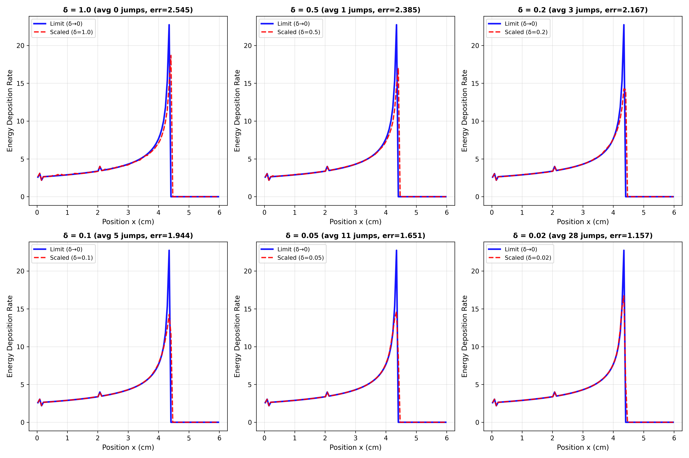
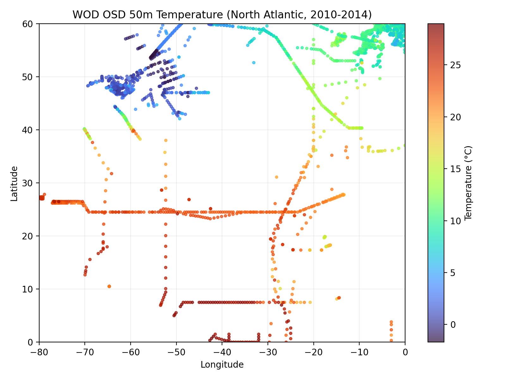
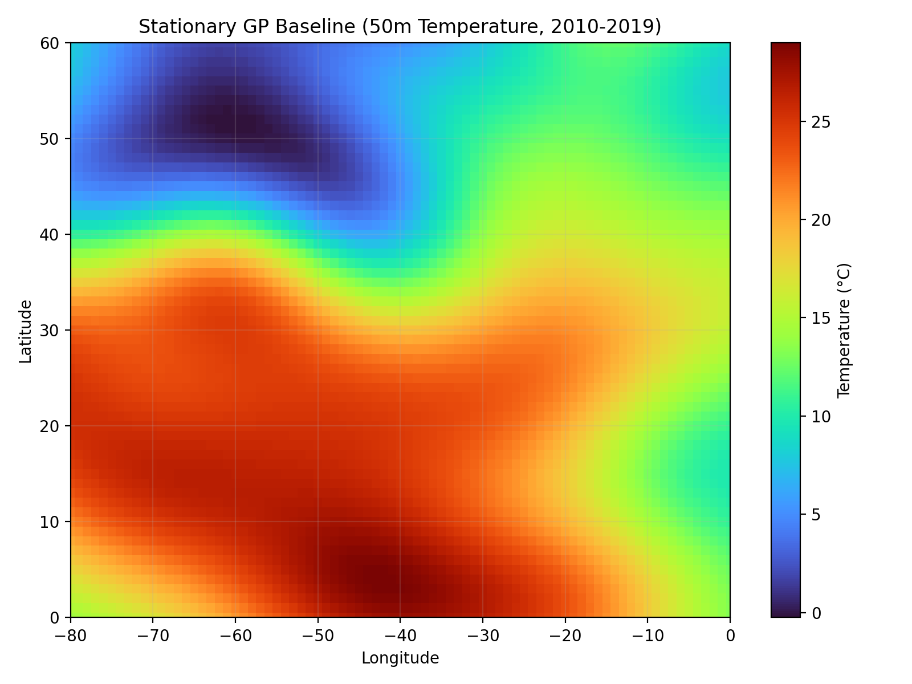
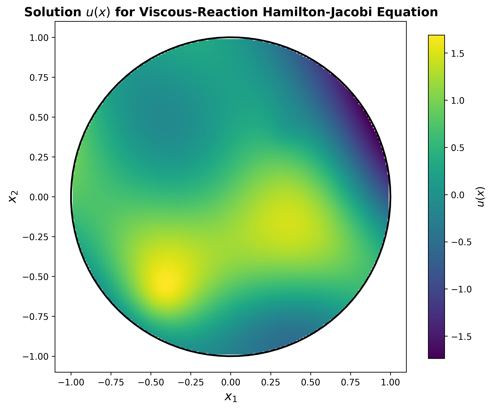
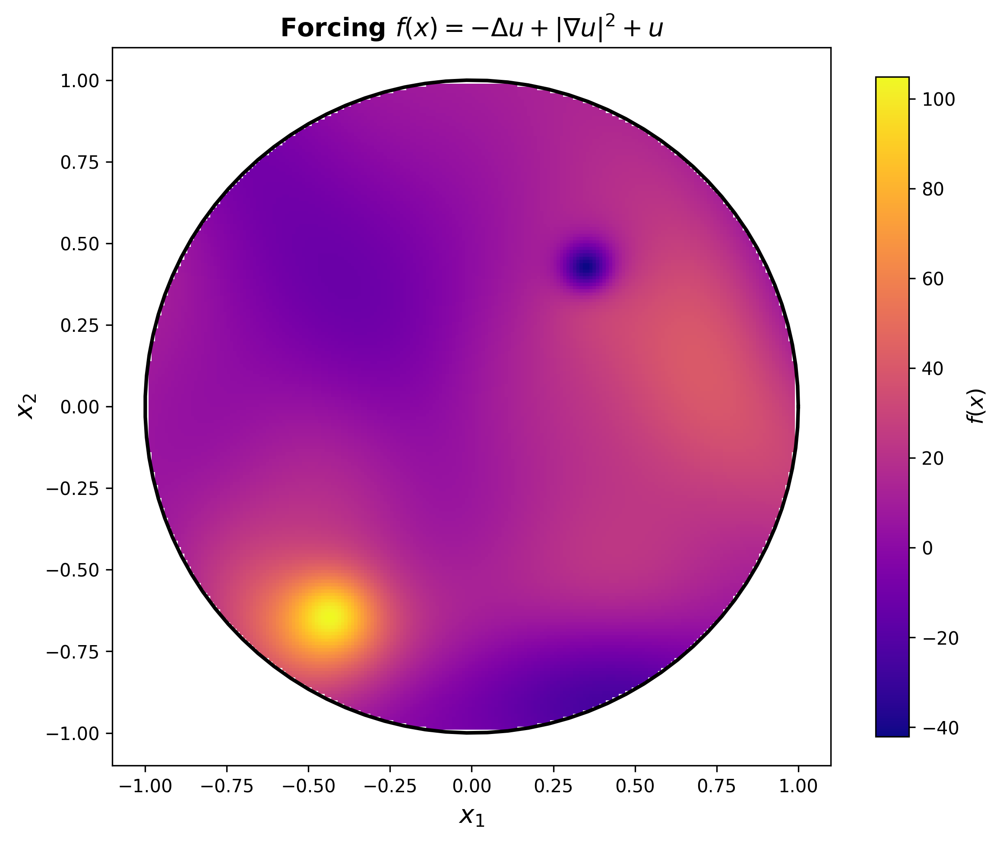

## Can agents write entire mathematics papers?

I am very excited to be working on a project to assess the capabilities of AI agents to write entire pure and applied mathematics papers, including coming up with their own research questions.

Large Language Models have matched or exceeded human expert performance on economically valuable multi-hour tasks (GDPval), with task time horizons doubling every 6 months since 2019 (METR). The models have won gold medals in the mathematics, physics, and astrophysics olympiads (Deepmind, OpenAI) and have started solving conjectures encountered in research (Godel Test). Entirely new exams (FrontierMath, Humanity's Last Exam) above the level of human exams have been created to measure the performance of the latest models. Though AI performance is very impressive on these problems, these competition problems and conjectures are self-contained `small world' (Sutton, Big World hypothesis) problems with short solutions, in contrast to a full research program that could span months or years, involves selecting research questions, filtering information from millions of books and papers, and embedding the results into a coherent narrative. 

To assess the capabilities of AI on real research tasks we are testing whether agents can autonomously write entire pure and applied mathematics research papers, including coming up with its own research question. So far, we assess that the agents have poor research taste when it comes to coming up with good research questions, but are skilled at carrying out tasks when they are defined. For example we prompted Claude Sonnet 4.5 to write a paper related to a provided reference paper in applied probaility, resulting in the following paper by Claude

---

### Diffusion Approximation for One-Dimensional Proton Beam Transport: Rigorous Convergence Analysis and Error Bounds

---

[Download Paper (PDF)](figures/Sonnet.pdf)

In this paper, Claude analyses the convergence of one model of proton dynamics to another, and supports the result with some numerical experiments. The theoretical analysis is basically correct, and requires techniques in probability that are highly technical but standard in the field. However, it is not obvious what the purpose of the result is, so the quality of the research question was not rated highly by domain experts. Similarly Codex with GPT 5.2 was prompted to write a paper analysing any dataset from the World Oceanographic Database (WOD) using any technique in mathematical geophysics, and decided to write the following paper

---

### Spatial Structure of 50 m North Atlantic Temperature from WOD23

---

  
  

[Download Paper (PDF)](figures/GPT.pdf)

The core contribution is fitting a Gaussian field to temperature recordings of the North Atlantic. The model fitting seems to have been done well with careful consideration of some of the statistical details involved, but there is no compelling story of why this is a valuable scientific contribution. For models to truly replace human researchers they need to become more capable of designing ambitious research projects. If future agents can come up with interesting research ideas, then with their existing capabilities in mathematics and coding would result in a very capable autonomous researcher. 

## PDEbench: Can agents numerically solve PDEs?

This project is to develop PDEbench: a benchmark with verifiable solutions designed to test the capabilities of agents to numerically solve PDEs. Given a differential operator $L$, which may be nonlinear or time dependent in general, we first define a smooth function $u$ analytically. Then we define a source term $f := Lu$ analytically by symbolically differentiating $u$. This is called the method of manufactured solutions, and it yields a PDE problem with an exact solution. We can then give coding agents like Codex, Claude Code or Gemini the challenge of numerically solving the PDE problem $Lu = f$ for $u$ given $f$ and initial/boundary conditions. To prevent the agents reverse engineering the solution $u$ from the analytic form of $f$, we do not provide the analytic $f$ or initial/boundary conditions but instead provide the agents with the means to evaluate the functions and their derivatives at any point on the domain/boundary. We have to be careful when choosing the operator $L$ to ensure the PDE problem has a unique solution, but this technique works for a wide variety problems.

PDEbench is a test of both the agent's coding and mathematical skill, which can be made arbitrarily hard by increasing the dimension or complexity of the PDE, or increasing the complexity of the manufactured solution. We can also test mathematical skill directly by creating situations where a PDE can be transformed to an easier one using change of variables or introduce symmetries in the solution. We also state in the prompt that the agent must return a python function that can be evaluated anywhere on the domain, which approximates the true solution to a given tolerance. This allows us to cheaply and automatically evaluate the correctness of the solution, resulting in an effective benchmark that could be used for model evaluation or RL.

An example PDE we asked the agents to solve is $-\Delta u + | \nabla u |^2 + u = f$ with Dirichlet boundary conditions on the $d$-sphere. We can see what this looks like on the disc with an example solution $u$

  
  

In low dimensions the agents generally opted for the finite difference method, exploiting the regular geometry of the sphere. However in higher dimensions (4+) this approach becomes non-viable due to the curse of dimensionality. Recognising this, all 3 coding agents opted to use Physics Informed Neural Networks to solve higher dimension problem. Interestingly, if we give the agents the PDE $-\Delta u + | \nabla u |^2 = f$ they spotted that applying Cole-Hopf transformation yields a linear PDE that can solved with different techniques that exploit linearity. 

https://github.com/AllenGrahamHart/LLMs-mathematics-research
https://github.com/AllenGrahamHart/PDEbench
